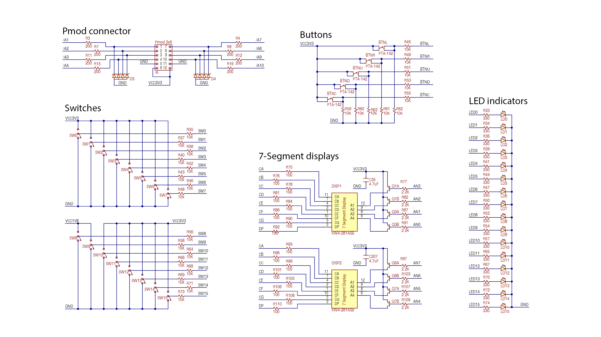
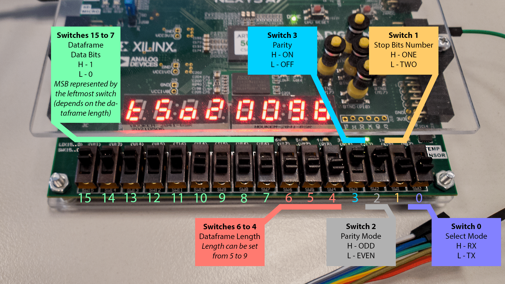
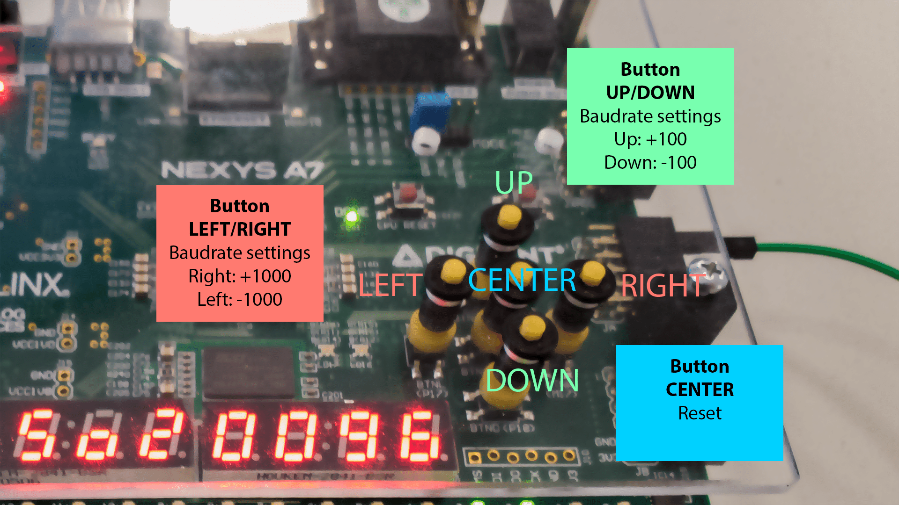
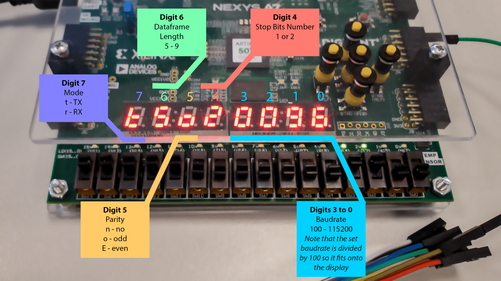
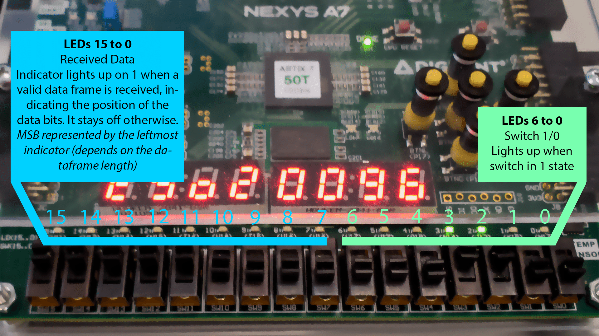
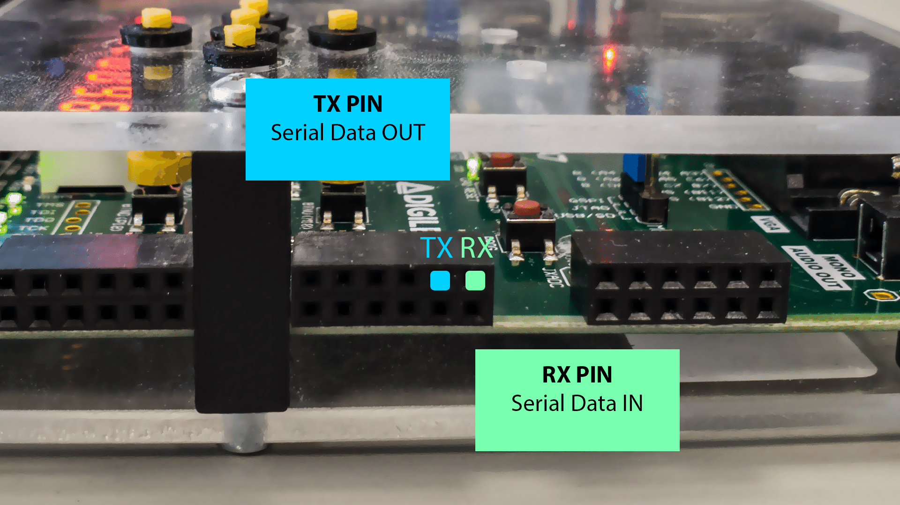

# VHDL UART project

This project is part of the Digital Electronics course (BPC-DE1 22/23L) at Brno University of Technology, Czechia. In this project, we aim to implement a UART (Universal Asynchronous Receiver-Transmitter) communication protocol using VHDL.

### Team members

* Josef Caha    (responsible for ...)
* Jakub Lepík   (responsible for ...)

## Theoretical description and explanation

UART is a widely-used hardware communication protocol for establishing communication between devices that require low-speed data transfer. The protocol is simple, reliable and commonly used in microcontroller, sensor, and other device applications. The UART interface consists of two lines, a transmit line (TX) and receive line (RX), and data is transmitted serially over these lines, one bit at a time.

The frame of the UART protocol comprises a start bit, 5-9 data bits, optional parity bit, and one or more stop bits. The start bit indicates the beginning of a data transmission, while the stop bit(s) signal the end. The start bit is always a logic low (0), and the stop bit(s) is a logic high (1). The data bits are transmitted in order from the least significant bit to the most significant bit. The parity bit is used for error checking, with its value being set to ensure that the total number of logic high bits transmitted is either odd or even.

The baud rate is an important parameter of UART communication and refers to the number of bits transmitted per second. To establish successful communication, the baud rate must be the same for both the transmitting and receiving devices. Common baud rates for serial communication include 9600 bps, 19200 bps, and 115200 bps.

### Transmitter

A transmitter takes a parallel signal with specific configuration settings and converts it into a serial signal. The transmitter then sends the serial signal which includes a start bit, data frame, optional parity bits, and one or two end bits.

### Receiver

To receive data, a receiver takes a serial signal transmitted one bit at a time with specific configuration settings, including a start bit, data frame, optional parity bits, and one or two end bits. The receiver then converts the serial signal into a parallel signal with the original configuration settings, checking for any errors in the received signal using the parity bits (if present), and outputs the resulting parallel signal.

## Hardware description of demo application

The demo application is implemented on a Nexys A7 development board with the following hardware components:

- 15 switches: These switches are used to set the data frame and its parameters. Nine switches are used to set the data frame, three switches are used to set the data frame length, one switch is used to enable or disable parity, one switch is used to select parity odd/even, one switch is used to select one or two stop bits, and one switch is used to switch between TX and RX mode.
- 8 digit seven-segment display: It includes one digit for indicating whether it's in transmitter or receiver mode, one digit for data frame length, one digit for stop bit configuration, one digit for parity configuration, and the last four digits display the currently set baud rate.
- The 15 LED indicators: The first nine LEDs are used to display the received data frame when parity is set to none or when the data is safely received. When the bit in the corresponding position is 1, the LED is on, and when it is 0, the LED is off.
- BTNC, BTNL, BTNR, BTNU, BTND buttons: These buttons are used to set the baudrate and BTNC to reset the aplication.
- Pmod connector: Only two pins (RX and TX) from the PMOD connector are used to enable communication between the board and external devices. The RX pin is used to receive data, while the TX pin is used to transmit data.

> Schematic of the used hardware parts of the Nexys A7 board from [Reference manual](https://digilent.com/reference/programmable-logic/nexys-a7/reference-manual)

## Software description

**Reciever**

The receiver module converts serial data to a vector using a clock signal and handles different UART frame settings. It uses an up-down counter to sync with incoming data and verifies data integrity by checking if the number of '1's in the dataframe is odd/even.

You can check the [reciever code here.](https://github.com/kubikulek231/de1-project/blob/master/UART/UART/UART.srcs/sources_1/new/receiver.vhd)

**Transmiter**

The transmitter module serializes data by outputting a start bit and bit-by-bit with the clock signal. It handles various UART frame settings and adds parity bits based on user settings, and outputs one or two stop bits. It also uses an up-down counter to sync with incoming data.

You can check the [transmitter code here.](https://github.com/kubikulek231/de1-project/blob/master/UART/UART/UART.srcs/sources_1/new/transmitter.vhd)

**TOP**

The top entity serves as the user interface for the UART system and connects with the receiver and transmitter modules. It allows the user to set up the UART frame and parity settings via switches and buttons, sends out data from transmitter mode and displayes the received incoming data on LED indicators.

You can check the [top-structure code here.](https://github.com/kubikulek231/de1-project/blob/master/UART/UART/UART.srcs/sources_1/new/top.vhd)

Put flowchats/state diagrams of your algorithm(s) and direct links to source/testbench files in `src` and `sim` folders. 

### Component(s) simulation

You can check the [reciever **simulation** code here.](https://github.com/kubikulek231/de1-project/blob/master/UART/UART/UART.srcs/sim_1/new/tb_receiver.vhd)
You can check the [transmitter **simulation** code here.](https://github.com/kubikulek231/de1-project/blob/master/UART/UART/UART.srcs/sim_1/new/tb_transmitter.vhd)
You can check the [top-structure **simulation** code here.](https://github.com/kubikulek231/de1-project/blob/master/UART/UART/UART.srcs/sim_1/new/tb_top.vhd)

Write descriptive text and simulation screenshots of your components.

## Instructions

#### Videos
The video demonstrates the use of the 15 switches to configure the data frame and its parameters. It shows how to set the data frame, data frame length, enable/disable parity, select parity odd/even, configure one or two stop bits, and switch between TX and RX modes. The video showcases the seamless switching on and off of these settings and provides a comprehensive overview of the process of setting up the board for communication.
- Link: https://www.youtube.com/watch?v=0lwEhEY8TVo

In the second video, I demonstrate how to set up the Nexys board in transmission mode, configure the data frame settings, and set the baudrate. The process is captured using a logic analyzer connected to the Nexys board, and the received signal is displayed on the computer. The video showcases the successful transmission of the data frame set up using the switches on the board, and highlights the detection of errors when the parity is set incorrectly.
- Link: https://www.youtube.com/watch?v=YKf-yF5lCpU

In the third video, I demonstrate the board in receiving mode. I connected the board to an Arduino, which sends a serial signal based on the keys pressed on a connected keyboard. The video shows the corresponding LED on the board lighting up as I press the keys on the numpad, indicating the received signal.
- Link: https://www.youtube.com/watch?v=l6r-ZX2BniM

#### Manual

> The switches are used to set the data frame and its parameters in the UART communication.

> The BTNL, BTNR, BTNU, and BTND buttons are used to set the baudrate and BTNC to reset the application by pressing it.

> The display shows the current status of the UART aplication.

> The LEDs indicate UART communication state. The first 9 show received data when parity is none or data is safely received, with each LED corresponding to a bit, on when 1 and off when 0.

> The RX pin is used to receive data, while the TX pin is used to transmit data.

## References

- https://en.wikipedia.org/wiki/Universal_asynchronous_receiver-transmitter
- https://digilent.com/reference/programmable-logic/nexys-a7/reference-manual
- https://digilent.com/reference/_media/programmable-logic/nexys-a7/nexys-a7-d3-sch.pdf
