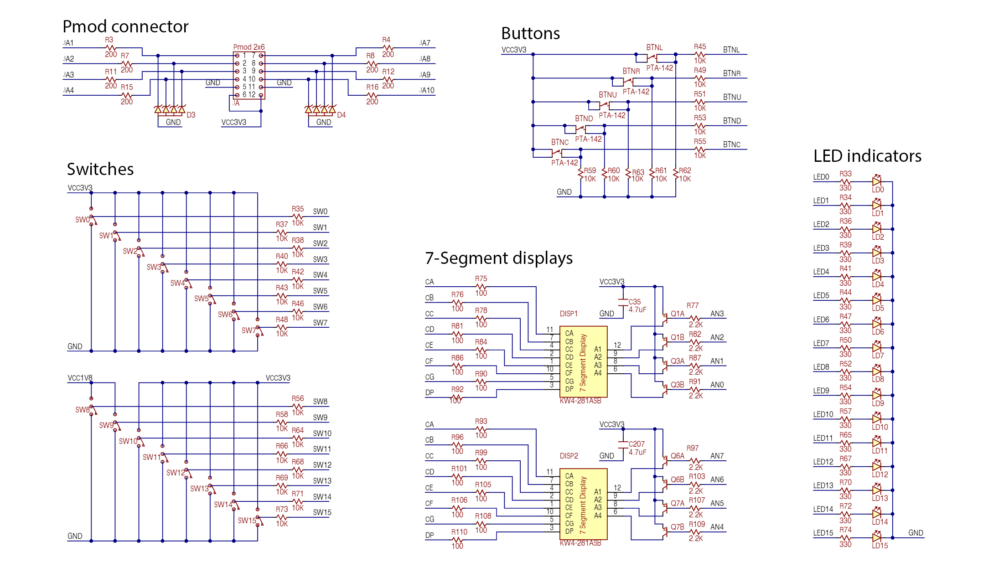
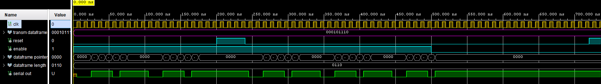
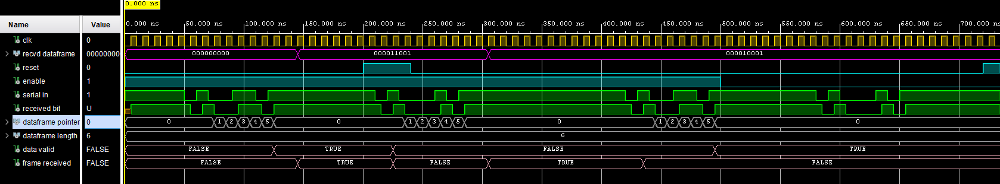
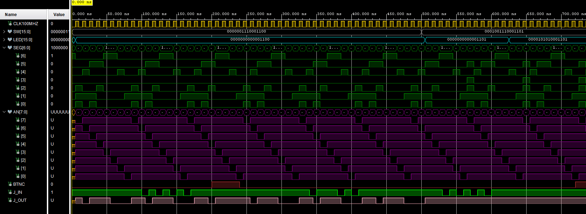
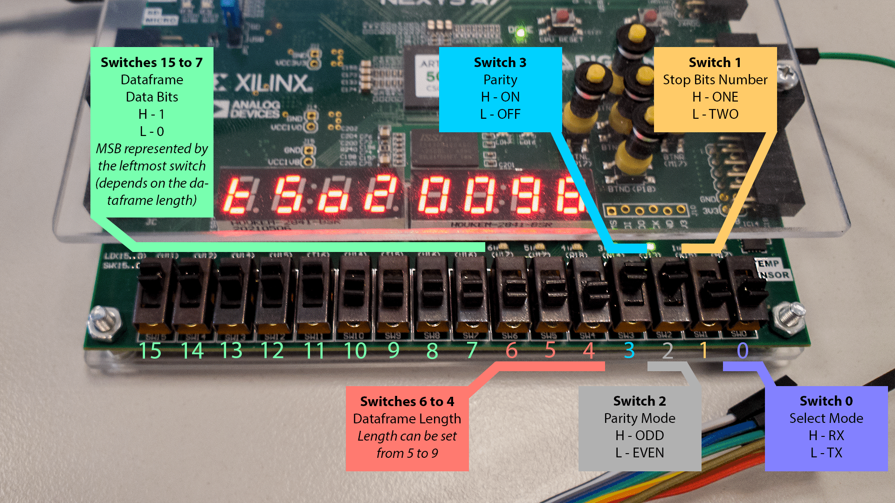
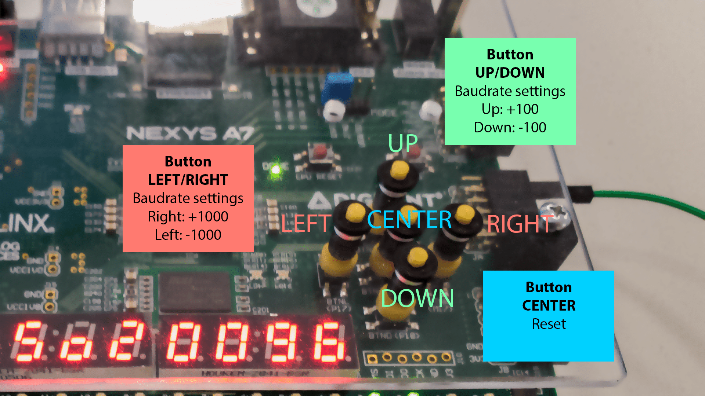
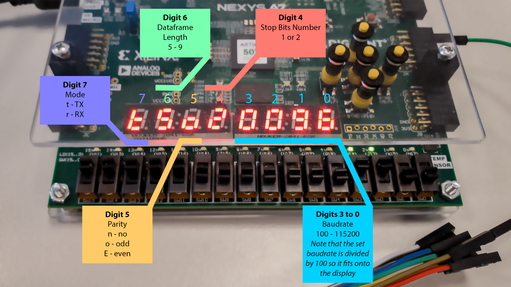
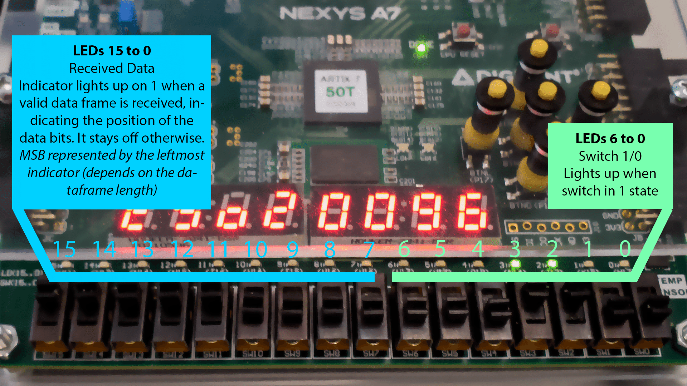
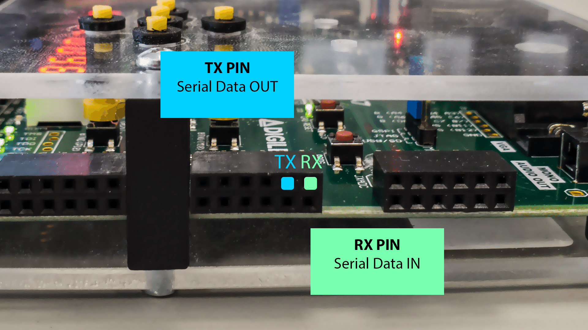

# VHDL UART Project

This project is part of the Digital Electronics course (BPC-DE1 22/23L) at Brno University of Technology, Czechia. In this project, we aim to implement a UART (Universal Asynchronous Receiver-Transmitter) communication protocol using VHDL.

### Table of contents
- [VHDL UART project](#vhdl-uart-project)
    + [Team members](#team-members)
  * [Theoretical description and explanation](#theoretical-description-and-explanation)
    + [Transmitter](#transmitter)
    + [Receiver](#receiver)
  * [Hardware description of demo application](#hardware-description-of-demo-application)
  * [Software description](#software-description)
    + [Components simulation](#components-simulation)
  * [Instructions](#instructions)
      - [Video showcase](#video-showcase)
      - [Manual](#manual)
  * [References](#references)

### Team members

* Josef Caha
* Jakub Lepík

## Theoretical description and explanation

UART is a widely-used hardware communication protocol for establishing communication between devices that require low-speed data transfer. The protocol is simple, reliable and commonly used in microcontroller, sensor, and other device applications. The UART interface consists of two lines, a transmit line (TX) and receive line (RX), and data is transmitted serially over these lines, one bit at a time.

The frame of the UART protocol comprises a start bit, 5-9 data bits, optional parity bit, and one or more stop bits. The start bit indicates the beginning of a data transmission, while the stop bit(s) signal the end. The start bit is always a logic low (0), and the stop bit(s) is a logic high (1). The data bits are transmitted in order from the least significant bit to the most significant bit. The parity bit is used for error checking, with its value being set to ensure that the total number of logic high bits transmitted is either odd or even.

The baud rate is an important parameter of UART communication and refers to the number of bits transmitted per second. To establish successful communication, the baud rate must be the same for both the transmitting and receiving devices. Common baud rates for serial communication include 9600 bps, 19200 bps, and 115200 bps.

### Transmitter

A transmitter takes a parallel signal with specific configuration settings and converts it into a serial signal. The transmitter then sends the serial signal which includes a start bit, data frame, optional parity bits, and one or two end bits.

### Receiver

To receive data, a receiver takes a serial signal transmitted one bit at a time with specific configuration settings, including a start bit, data frame, optional parity bits, and one or two end bits. The receiver then converts the serial signal into a parallel signal with the original configuration settings, checking for any errors in the received signal using the parity bits (if present), and outputs the resulting parallel signal.

## Hardware description of demo application

The demo application is implemented on a Nexys A7 development board with the following hardware components:

- 15 switches: These switches are used to set the data frame and its parameters. Nine switches are used to set the data frame, three switches are used to set the data frame length, one switch is used to enable or disable parity, one switch is used to select parity odd/even, one switch is used to select one or two stop bits, and one switch is used to switch between TX and RX mode.
- 8 digit seven-segment display: It includes one digit for indicating whether it's in transmitter or receiver mode, one digit for data frame length, one digit for stop bit configuration, one digit for parity configuration, and the last four digits display the currently set baud rate.
- The 15 LED indicators: The first nine LEDs are used to display the received data frame when parity is set to none or when the data is safely received. When the bit in the corresponding position is 1, the LED is on, and when it is 0, the LED is off.
- BTNC, BTNL, BTNR, BTNU, BTND buttons: These buttons are used to set the baudrate and BTNC to reset the aplication.
- Pmod connector: Only two pins (RX and TX) from the PMOD connector are used to enable communication between the board and external devices. The RX pin is used to receive data, while the TX pin is used to transmit data.

> Schematic of the used hardware parts of the Nexys A7 board from [Reference manual](https://digilent.com/reference/programmable-logic/nexys-a7/reference-manual)

## Software description
The VHDL code consists of several entities:

- **Transmiter** module
  - The transmitter module serializes data by outputting a start bit and bit-by-bit with the clock signal. It handles various UART frame settings and adds parity bits based on user settings, and outputs one or two stop bits. It also uses an up-down counter to sync with incoming data.  
  - View the code for [transmitter.vhd](https://github.com/kubikulek231/de1-project/blob/master/UART/UART/UART.srcs/sources_1/new/transmitter.vhd)

- **Reciever** module
  - The receiver module converts serial data to a vector using a clock signal and handles different UART frame settings. It uses an up-down counter to sync with incoming data and verifies data integrity by checking if the number of '1's in the dataframe is odd/even.
  - View the code for [receiver.vhd](https://github.com/kubikulek231/de1-project/blob/master/UART/UART/UART.srcs/sources_1/new/receiver.vhd)

- **Top** module 
  - The top entity serves as the user interface for the UART system and connects with the receiver and transmitter modules. It allows the user to set up the UART frame and parity settings via switches and buttons, sends out data from transmitter mode and displayes the received incoming data on LED indicators.
  - View the code for [top.vhd](https://github.com/kubikulek231/de1-project/blob/master/UART/UART/UART.srcs/sources_1/new/top.vhd)

- **Other modules**
  - Clock enable, Counter and Hex to Seg converter entities with sligh moddifications. Original modules can be found in DE1 course [repository](https://github.com/tomas-fryza/digital-electronics-1).
  - View the code for [clock_enable.vhd](https://github.com/kubikulek231/de1-project/blob/master/UART/UART/UART.srcs/sources_1/new/clock_enable.vhd), [clock_enable.vhd](https://github.com/kubikulek231/de1-project/blob/master/UART/UART/UART.srcs/sources_1/new/clock_enable.vhd), [hex_7_seg.vhd](https://github.com/kubikulek231/de1-project/blob/master/UART/UART/UART.srcs/sources_1/new/hex_7_seg.vhd)

### Components simulation

Simulated weveforms of *transmitter* entity using [tb_transmitter](https://github.com/kubikulek231/de1-project/blob/master/UART/UART/UART.srcs/sim_1/new/tb_transmitter.vhd) testbench file

>In this simulation you can see the simulated behavior of transmitter entity, there is the *transmitted dataframe* vector signal, which resembles the data to transmit. The *dataframe pointer* is there to store the information about which data bit from the dataframe will be transmitted next, *dataframe length* then tells how many data bits in dataframe are. The *serial out* signal then shows the transmitted UART data. The simulation also shows how the entity acts upon *reset* and *enable* signals.

Simulated weveforms of *receiver* entity using [tb_receiver](https://github.com/kubikulek231/de1-project/blob/master/UART/UART/UART.srcs/sim_1/new/tb_receiver.vhd)  testbench file  

>In the simulation of receiver entity there is the *serial in* signal where the serial data to be received by the receiver entity is, *received dataframe* vector signal resembles the received dataframe. The *dataframe pointer* is there to store the information about which data bit from the dataframe will be received next, *dataframe length* then tells how many data bits in dataframe are. The boolean *data valid* signal indicates whether the received data's parity is valid, *frame received* indicates whether the UART was received. The simulation also shows how the entity acts upon *reset* and *enable* signals.

Simulated weveforms of *top* entity using [tb_top](https://github.com/kubikulek231/de1-project/blob/master/UART/UART/UART.srcs/sim_1/new/tb_top.vhd) testbench file

>As the top entity connects the user input elements with the receiver and transmitter entities, the simulation shows the _SW_ input switches vector, which has been initially set to transmitter mode. Received dataframe is displayed with the first 9 bits of the *LED* signal. Segmented display output is represented by the *SEG* signal and the complementary *AN* signal shows which digit is currently being shown (anode is pulled low). The reset signal is resembled by the *BTNC* button signal and the UART serial input and output is shown by the *J_IN* and *J_OUT* signals respectively. 

## Instructions

#### Video showcase
Configuration
- The first video showcases the process of configuring the Nexys board for communication using the 15 switches available on the board. The video demonstrates how to set up various parameters such as the data frame, data frame length, parity, stop bits, and switching between transmission and reception modes. It provides a comprehensive overview of the process, highlighting the seamless switching on and off of these settings.
- [Link to the first video](https://www.youtube.com/watch?v=0lwEhEY8TVo)

Transmitter mode
- In the second video, the process of setting up the Nexys board for transmission mode is demonstrated. The video captures the process using a logic analyzer connected to the Nexys board, with the received signal displayed on a computer. The successful transmission of the configured data frame using the switches on the board is showcased, along with the detection of errors that occur when the parity is set incorrectly.
- [Link to the second video](https://www.youtube.com/watch?v=YKf-yF5lCpU)

Receiver mode
- In the third video, the board is demonstrated in receiving mode, with the board connected to an Arduino. The Arduino sends a serial signal based on the keys pressed on a connected keyboard, which is received by the Nexys board. The video shows the corresponding LED on the board lighting up as the keys on the numpad are pressed, indicating the received signal.
- [Link to the third video](https://www.youtube.com/watch?v=l6r-ZX2BniM)

#### Manual

> The switches are used to set the data frame and its parameters in the UART communication.

> The BTNL, BTNR, BTNU, and BTND buttons are used to set the baudrate and BTNC to reset the application by pressing it.

> The display shows the current status of the UART aplication.

> The LEDs indicate UART communication state and received dataframe.

> The RX pin is used to receive data, while the TX pin is used to transmit data.

## References

- https://en.wikipedia.org/wiki/Universal_asynchronous_receiver-transmitter
- https://digilent.com/reference/programmable-logic/nexys-a7/reference-manual
- https://digilent.com/reference/_media/programmable-logic/nexys-a7/nexys-a7-d3-sch.pdf
- https://github.com/tomas-fryza/digital-electronics-1
